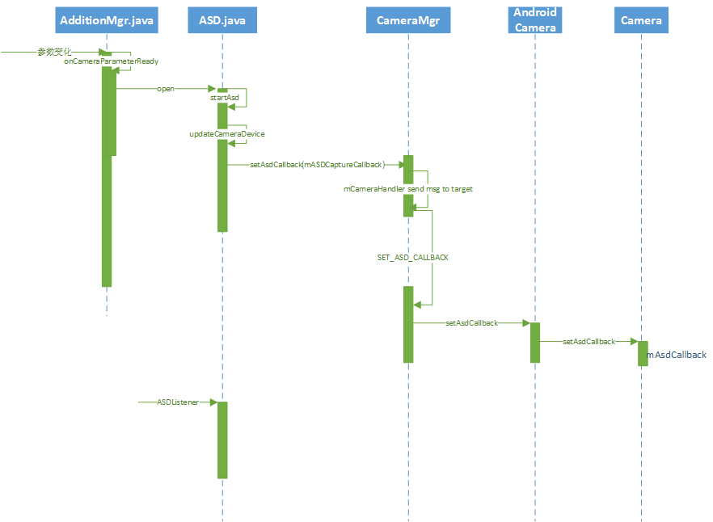

## 相关文件路径

> **Java层:**
> /vendor/mediatek/proprietary/packages/apps/Camera/src/
> - /com/mediatek/camera/AdditionManager.java
> - /com/mediatek/camera/addition/Asd.java
> - /com/android/camera/CameraManager.java
> - /com/android/camera/AndroidCamera.java
>
> **framework层：**
> /frameworks/av/camera/Camera.cpp
> /frameworks/av/camera/CameraBase.cpp
> /frameworks/av/services/camera/libcameraservice/api1/CameraClient.cpp
> /frameworks/av/services/camera/libcameraservice/mediatek/api1/CameraClient.cpp
> /frameworks/base/core/java/android/hardware/Camera.java
>
> **jni层：**
>  /frameworks/base/core/jni/android_hardware_Camera.cpp
>
> **Hardware层：**
> vendor/mediatek/proprietary/hardware/mtkcam/
> - legacy/platform/mt6735/core/featureio/pipe/aaa/Hal3AAdapter1.cpp
> - legacy/platform/mt6735/core/featureio/pipe/asd/asd_hal_base.cpp
> - legacy/platform/mt6735/core/featureio/pipe/asd/asd/asd_hal.cpp
> - legacy/platform/mt6735/v1/client/CamClient/FD/Asd/AsdClient.cpp
> - legacy/platform/mt6735/v1/client/CamClient/FD/FDClient.Thread.cpp
> - main/hal/device1/common/Cam1DeviceBase.cpp
> - legacy/v1/client/CamClient/CamClient.cpp


## 1. 引言

最近遇到了ASD(自动场景检测)在室内光线较好的情况下，会选择到夜间模式，需要调整其阈值。于是分析了MTK平台对于Camera1架构的源码实现流程，梳理了ASD的工作流程(App->framework->jni->HAL)，但也仅是对源码流程的一个贯穿，没有对具体实现深入分析。以后若有时间进一步学习，再做补充。

分析思路：

1. 先以设置里打开ASD开关为触发点，预览界面/场景检测结果更新为截止点，抓取camera的mtklog；
2. 检索log的关键信息，找到App层的入口，分析在上层及framework层所做的操作；
3. 检索log的关键信息，找到HAL层的入口，分析在HAL层的事件处理以及消息传递；
4. 结合2和3的分析结果，分析framework层与HAL层的jni通信；


## 2. 架构

camera架构图如下：


> **应用框架**
> 应用代码位于应用框架级别，它利用 [android.hardware.Camera](http://developer.android.com/reference/android/hardware/Camera.html) API 来与相机硬件互动。在内部，此代码会调用相应的 JNI 粘合类，以访问与该相机互动的原生代码。
>
> **JNI**
> 与 [android.hardware.Camera](http://developer.android.com/reference/android/hardware/Camera.html) 关联的 JNI 代码位于 `frameworks/base/core/jni/android_hardware_Camera.cpp`。此代码会调用较低级别的原生代码以获取对物理相机的访问权限，并返回用于在框架级别创建 [android.hardware.Camera](http://developer.android.com/reference/android/hardware/Camera.html) 对象的数据。
>
> **原生框架**
> 在 `frameworks/av/camera/Camera.cpp` 中定义的原生框架可提供相当于 [android.hardware.Camera](http://developer.android.com/reference/android/hardware/Camera.html) 类的原生类。此类会调用 IPC binder 代理，以获取对相机服务的访问权限。
>
> **Binder IPC 代理**
> IPC binder 代理有助于越过进程边界实现通信。调用相机服务的 `frameworks/av/camera` 目录中有 3 个相机 binder 类。ICameraService 是相机服务的接口，ICamera 是已打开的特定相机设备的接口，ICameraClient 是返回应用框架的设备接口。
>
> **相机服务**
> 位于 `frameworks/av/services/camera/libcameraservice/CameraService.cpp` 下的相机服务是与 HAL 进行互动的实际代码。
>
> **HAL**
> 硬件抽象层定义了由相机服务调用且您必须实现以确保相机硬件正常运行的标准接口。
>
> **内核驱动程序**
> 相机的驱动程序可与实际相机硬件和您的 HAL 实现进行互动。相机和驱动程序必须支持 YV12 和 NV21 图片格式，以便在显示和视频录制时支持预览相机图片。


以上信息引用自：https://source.android.com/devices/camera/ 。接下来顺着Camera1的纵线流程来分析MTK平台上ASD是如何工作的。


## 3. 启动流程(App、Framework层)

### 3.1 启动流程图



接下来，从源码来说说这个流程图。

### 3.2 AdditionManager.java

```java
public void onCameraParameterReady(boolean isMode) {
    // 参数变化时会调用到这里
    Log.i(TAG, "[onCameraParameterReady]isMode = " + isMode);
    Vector<ICameraAddition> curAddition = mModeAddition;
    if (!isMode) {
        curAddition = mNormalAddition;
    }
    for (ICameraAddition addition : curAddition) {
        // Asd继承自CameraAddition
        // 在这里判断Asd开关是否支持&打开
        boolean isSupport = addition.isSupport();
        boolean isOpen = addition.isOpen();
        if (isSupport && !isOpen) {
        	// 如果支持且开关已打开，则调用Asd的open方法打开Asd模式
            addition.open();
        } else if (!isSupport && isOpen) {
            addition.close();
        }
    }
}
```

### 3.3 Asd.java

```java
@Override
public void open() {
    Log.d(TAG, "[open]...");
    startAsd();
}

public void startAsd() {
    Log.i(TAG, "[startAsd]...");
    // 更新当前camera设备实例
    updateCameraDevice();
    if (mICameraDevice == null) {
        return;
    }
    // 这里通知framework层做Asd Callback的初始化和设置
    // 用来接收来自HAL层的消息
    mICameraDevice.setAsdCallback(mASDCaptureCallback);
    // 更新ASD状态
    mCurrentState = AsdState.STATE_OPENED;
}
```

### 3.4 CameraManager.java

```java
@Override
public void setAsdCallback(AsdListener asdListener) {
	// 创建AsdListener实例
    mCameraDevice.setAsdCallback(asdListener == null ? null : new AsdListenerImpl(asdListener));
}

public void setAsdCallback(AsdCallback asdCallback) {
	// 通知内部类CameraHandler，设置AsdCallback
    mCameraHandler.obtainMessage(SET_ASD_CALLBACK, asdCallback).sendToTarget();
    waitDone();
}

private class CameraHandler extends Handler {
    @Override
    public void handleMessage(final Message msg) {
        ...
        case SET_ASD_CALLBACK:
        // 这里mCamera是ICamera实例，接口在AndroidCamera中实现
        mCamera.setAsdCallback((AsdCallback) msg.obj);
        return;
        ...
    }
}
```
### 3.5 AndroidCamera.java

```java
public void setAsdCallback(AsdCallback cb) {
	// 调用Camera1接口设置Asd的回调
    mCamera.setAsdCallback(cb);
}
```

### 3.6 android.hardware.Camera.java

```java
/**
 * @hide
 * @internal
 *
 * Registers a callback to be invoked when auto scene is detected
 * @param cb the callback to run
 */
public final void setAsdCallback(AsdCallback cb) {
	// 设置framework层的AsdCallback回调实例
    mAsdCallback = cb;
}
```

### 3.7 AsdCallback的创建

```java
// Asd.java的内部类，实现了AsdListener接口
// 用于接收来自HAL层的消息，然后通知camera ui做出相应处理
private final AsdListener mASDCaptureCallback = new AsdListener() {
    public void onDeviceCallback(int scene) {
        Log.i(TAG, "[onDeviceCallback] onDetected scene = " + scene + "," +
                "mLastScene:" + mLastScene);

        if (mLastScene != scene) {
            boolean suggestedHdr = (scene == SCENE_BACK_LIGHT
                    || scene == SCENE_BACK_LIGHT_PORTRAIT);
            // 通知camera ui场景的选择结果
            mICameraAppUi.onDetectedSceneMode(scene, suggestedHdr);
            mLastScene = scene;
        }
    }
};
```


## 4. 处理流程及消息回调(Hardware层)

下面主要讲述在Hardware层，Asd是如何初始化其Client，然后根据camera设备提供的信息进行场景选择，将结果返回给framework层的Camera1，随后传递到上层Camera app的。首先来看看流程图。

### 4.1 处理流程图


### 4.2 Hardware层文件说明

- **FDClient、AsdClient.cpp :**  Camera的每个feature好像都有一个专属的Client，每个Client又有专属的Client.Thead线程用来处理各类事件；而Asd的场景列表中有人脸模式（在后续的scene decider时也传入了facenum这样的参数）。这里没有进行深入研究，这里就先暂不拓展，因为整个camera架构还是很大的Orz
- **asd_hal.cpp :**  该流程的核心成员，主要功能是halASD实例的创建与销毁、ASD的初始化、场景选择。MTK在这里进行ASD各场景的阈值设置，同时分离了一个客制化的配置文件`camera_custom_asd.h`，客户可在HalAsdInit初始化的时候读取该客制化文件的值，从而客制化修改ASD场景的阈值；
- **CameraClient.cpp :**  用以接收来自AsdClient的回调消息；
- **Camera.cpp :**  上报回调消息到jni层；
- **android_hardware_Camera.cpp :**  jni层的实现

### 4.3 FD.Client.Thread.cpp
```java
// PreviewClient的state发生变化时会发送eID_WAKEUP消息
// FDClient应该也会接收到，这里没去细看
bool FDClient::threadLoop()
{
    Command::EID cmd;
    if  ( getCommand(cmd) )
    {
        switch  (cmd)
        {
        case Command::eID_WAKEUP:
            // 初始化一些Client
            onClientThreadLoop();
            break;
        //
        case Command::eID_EXIT:
        default:
            MY_LOGD("Command::%d", cmd);
            break;
        }
    }
    ...
}

void FDClient::onClientThreadLoop()
{
    ...
    #if (1 == AUTO_SCENE_DETECT_SUPPORT)
    //ASD Init
    // 创建AsdClient实例
    mpASDClient = IAsdClient::createInstance(mpParamsMgr);
    // 调用AsdClient的init方法初始化AsdClient
    if  ( mpASDClient == 0 || ! mpASDClient->init() )
    {
        MY_LOGE("mpASDClient init failed");
    }
    // 设置回调
    mpASDClient->setCallbacks(mpCamMsgCbInfo);
    #endif
    //(3) Do in loop until stopFaceDetection has been called
    //    either by sendCommand() or by stopPreview()
    while ( isEnabledState() )
    {
        ...
        if (mpFDHalObj != NULL)
        {
          // (3.4)
          //performCallback(isDetected_FD, isDetected_SD);
          performCallback(isDetected_FD, isDetected_SD, isDetected_GD);

          #if (1 == AUTO_SCENE_DETECT_SUPPORT)
          //Call ASD if doFD
          if(isMsgEnabled())
          {
              int FaceNum = mpFDHalObj->halFDGetFaceResult(mpDetectedFaces);
              // 进行更新操作
              // 这里开始进入到AsdClient的流程(场景选择/消息回调)
              mpASDClient->update(DDPBuffer, srcWidth, srcHeight, FaceNum);
          }
          #endif
        }
        ...
    }
    ...
    #if (1 == AUTO_SCENE_DETECT_SUPPORT)
    if (mpASDClient != 0)
    {
        mpASDClient->uninit();
        mpASDClient = NULL;
    }
    #endif
    ...
}
```
### 4.4 AsdClient.cpp
```java
void
AsdClient::
update(MUINT8 * OT_Buffer, MINT32 a_Buffer_width, MINT32 a_Buffer_height, MINT32 a_FaceNum)
{
    MUINT32 u4Scene = 0;

    ASDInfo_T ASDInfo;
    bool const isAsdEnabled = mpParamsMgr->getShotModeStr() == MtkCameraParameters::CAPTURE_MODE_ASD_SHOT;
    enable(isAsdEnabled);
    if  ( ! isEnabled() )
    {
        return;
    }
    
    //Get 3A Info.
    MINT32 const i4SensorDevId = 1;
    
    //Need to be fixed. i4SensorDevId--> i4SensorDevIdIndex, BinChang 2014/01/13
    // 创建一个Hal3AAdapter实例，用以获取ASDInfo
    mpHal3A = IHal3A::createInstance(NS3A::IHal3A::E_Camera_1, mpParamsMgr->getOpenId(), LOG_TAG);
    mpHal3A->getASDInfo(ASDInfo);
    if (mpHal3A)
    {
        mpHal3A->destroyInstance(LOG_TAG);
    }
    
    //Get FD Info.
#if(0)
    mpHalFD = halFDBase::createInstance(HAL_FD_OBJ_FDFT_SW);
    mpHalFD->halFDGetFaceInfo(mpFaceInfo);
    if(mpHalFD)
    {
        mpHalFD->destroyInstance();
    }
#endif

    //Asd Pipe Init.
    // 初始化Asd管道
    if(mpHalASDObj == NULL)
    {
        //Set Frame: Prepare QVGA RGB565 resolution
        if(a_Buffer_width*3 == a_Buffer_height*4)
            Buffer_height = 240;
        else if(a_Buffer_width*9 == a_Buffer_height*16)
            Buffer_height = 180;
        else if(a_Buffer_width*3 == a_Buffer_height*5)
            Buffer_height = 192;
        else
            Buffer_height = 240;
    	// 创建halAsd实例
        mpHalASDObj = halASDBase::createInstance(HAL_ASD_OBJ_AUTO);
        if(mpHalASDObj == NULL)
        {
            MY_LOGE("mpHalASDObj createInstance fail");
        }
        // 初始化halAsd实例，这里传入了一个ASDInfo，里面是AWB的一些信息
        // 参数的客制化修改也是在这里进行
        mpHalASDObj->mHalAsdInit((void*)&ASDInfo, mpWorkingBuf, (eSensorType==SENSOR_TYPE_RAW)?0:1, Buffer_width/2, Buffer_height/2);
    }
    
    //Asd Pipe Decider
    // 开始场景检测，这里交由mtk封装的camera算法lib库文件处理，结果是返回到mSceneCur
    // 注意这里还传入了一个参数a_FaceNum，所以说FDClient跟AsdClient是有关联的
    mpHalASDObj->mHalAsdDecider((void*)&ASDInfo, a_FaceNum ,mSceneCur);
    //MY_LOGD("ASDInfo.bAEBacklit:%d ", ASDInfo.bAEBacklit);
    //MY_LOGD("mSceneCur:%d ", mSceneCur);
    
    u4Scene = mSceneCur;
    
    MY_LOGD("u4Scene:%d ", u4Scene);
    
    if  (1)
    {
    	// 消息处理，通知回调函数
    	// 这里的mNotifyDb回调函数是在CameraClient的initialize函数里设置了
    	// 对应CameraClient的notifyCallback函数，下面的CameraClient章节会说明一下这部分
        mpCamMsgCbInfo->mNotifyCb(
            MTK_CAMERA_MSG_EXT_NOTIFY, //msgType
            MTK_CAMERA_MSG_EXT_NOTIFY_ASD, //ext1
            u4Scene, //ext2
            mpCamMsgCbInfo->mCbCookie
        );
    }
    
    //MY_LOGD("Buffer_width:%d, Buffer_height:%d,", Buffer_width, Buffer_height);
    // 场景选择后的处理，这里主要是做了一些缓存区的申请
    mpHalASDObj->mHalAsdDoSceneDet((void*)OT_Buffer, Buffer_width, Buffer_height);
}
```
### 4.5 asd_hal.cpp

Asd初始化：

```java
MINT32 halASD::mHalAsdInit(void* AAAData,void* working_buffer,MUINT8 SensorType, MINT32 Asd_Buf_Width, MINT32 Asd_Buf_Height)
{

    ASD_Customize_PARA1 ASDThres1; //客制化参数集1
    ASD_Customize_PARA2 ASDThres2; //客制化参数集2
    g_udCount++;
    MY_LOGD("[halASD]  g_udCount++:%d \n", g_udCount);
    AAA_ASD_PARAM* rASDInfo=(AAA_ASD_PARAM*)AAAData;
    MINT32 Retcode = S_ASD_OK;
    MUINT32* AFtable=(MUINT32*)malloc((rASDInfo->i4AFTableIdxNum + 1)*sizeof(MUINT32));
    
    // debug开关，可通过设置property来打开，从而查看更多log信息
    char value[PROPERTY_VALUE_MAX] = {'\0'};
    property_get("ASD.debug.dump", value, "0");
    mHalASDDumpOPT = atoi(value);
    
    gMyAsdInitInfo.pInfo = &gMyAsdEnvInfo;
    gMyAsdInitInfo.pDeciderInfo = &gMyDeciderEnvInfo;
    gMyAsdInitInfo.pDeciderTuningInfo = &gMyDeciderTuningInfo;
    
    ...
    //这里省略的代码是做gMyAsdInitInfo的一些初始化操作，其中比较关键的是pDeciderInfo的初始化
    //主要是3A中的AWB、AF信息的获取和赋值
    ...
    
    //这里将pDeciderInfo的指针地址赋值为0了，使用mtk camera算法底层库的默认册数
    //如果需要对ASD的的参数进行客制化修改，需要注释掉这里
    //不然在客制化赋值的时候会找不到正确的内存地址，而导致修改无效
    gMyAsdInitInfo.pDeciderTuningInfo = 0;                        // use default value
    
    ...
    
    /*  Create MTKPano Interface  */
    //m_pMTKAsdObj用于调用底层库方法
    if(m_pMTKAsdObj == NULL)
    {
        m_pMTKAsdObj = MTKAsd::createInstance(DRV_ASD_OBJ_SW);
        MY_LOGW_IF(m_pMTKAsdObj == NULL, "Err");
    }

//客制化参数的获取和设置
//if (0)默认不编译，如果需要进行客制化修改，这里需要改成if (1)
#if (0)
	//从camera_custom.h中获取客制化参数集
    get_asd_CustomizeData1(&ASDThres1);
    get_asd_CustomizeData2(&ASDThres2);
    
    //客制化参数设置
    gMyAsdInitInfo.pDeciderTuningInfo->IdxWeightBlAe = ASDThres2.s2IdxWeightBlAe;
    ...
    gMyAsdInitInfo.pDeciderTuningInfo->EvLoThrNight = ASDThres2.s2EvLoThrNight;
    gMyAsdInitInfo.pDeciderTuningInfo->EvHiThrNight = ASDThres2.s2EvHiThrNight;
    ...
    gMyAsdInitInfo.pDeciderTuningInfo->ScoreThrNight = ASDThres1.u1ScoreThrNight;
    ...
#endif
	//初始化Asd
    m_pMTKAsdObj->AsdInit(&gMyAsdInitInfo, 0);

    if (AFtable) {
        free(AFtable);
    }
    return Retcode;
}
```
Asd场景检测：
```java
MINT32 halASD::mHalAsdDecider(void* AAAData,MINT32 Face_Num,mhal_ASD_DECIDER_UI_SCENE_TYPE_ENUM &Scene)
{
      MINT32 Retcode = S_ASD_OK;
      AAA_ASD_PARAM* rASDInfo=(AAA_ASD_PARAM*)AAAData;
      ASD_DECIDER_RESULT_STRUCT MyDeciderResult;
      ASD_SCD_RESULT_STRUCT gMyAsdResultInfo;
      ASD_DECIDER_INFO_STRUCT gMyDeciderInfo;
      
      ...
      //设置gMyDeciderInfo的Fd(人脸检测)、3A(AE&AWB&AF)信息
      ...
      
      // 这里的m_pMTKAsdObj在Asd init的时候创建了，用以调用MTK底层库封装的函数
      // AsdFeatureCtrl、AsdMain这两个函数的实现是在/vendor/xxx/libs中
      // 可以通过 grep 关键字 来检索
      m_pMTKAsdObj->AsdFeatureCtrl(ASD_FEATURE_GET_RESULT, 0, &gMyAsdResultInfo);
      memcpy(&(gMyDeciderInfo.InfoScd),&gMyAsdResultInfo, sizeof(ASD_SCD_RESULT_STRUCT));
      m_pMTKAsdObj->AsdMain(ASD_PROC_DECIDER, &gMyDeciderInfo);
      m_pMTKAsdObj->AsdFeatureCtrl(DECIDER_FEATURE_GET_RESULT, 0, &MyDeciderResult);
      MY_LOGD("[mHalAsdDecider] detect Scene is %d, Face Num:%d \n",MyDeciderResult.DeciderUiScene, gMyDeciderInfo.InfoFd.FdFaceNum);
    
      // 得到场景检测的结果
      Scene=(mhal_ASD_DECIDER_UI_SCENE_TYPE_ENUM) MyDeciderResult.DeciderUiScene;
    
      //Scene=mhal_ASD_DECIDER_UI_AUTO;
      return Retcode;
}
```
### 4.6 CameraClient.cpp

首先先来说说AsdClient中提到的mNotifyCb函数，这个函数是在CameraClient的initialize函数中被定义的。我们来看看代码：
```java
status_t CameraClient::initialize(CameraModule *module) {
    ...
    mHardware = new CameraHardwareInterface(camera_device_name);
    ...
    //调用的是Cam1DeviceBase的setCallback()函数
    mHardware->setCallbacks(notifyCallback,
            dataCallback,
            dataCallbackTimestamp,
            (void *)(uintptr_t)mCameraId);
    ...
}
```

接下来我们看看Cam1DeviceBase setCallback函数的实现：

```java
// Set the notification and data callbacks
void Cam1DeviceBase::setCallbacks(
    camera_notify_callback notify_cb, //notify Callback函数
    camera_data_callback data_cb, //data Callback函数
    camera_data_timestamp_callback data_cb_timestamp,
    camera_request_memory get_memory,
    void*user
)
{
    mpCamMsgCbInfo->mCbCookie       = user;
    mpCamMsgCbInfo->mNotifyCb       = notify_cb; //mNotifyCb函数赋值
    mpCamMsgCbInfo->mDataCb         = data_cb;   //mDataCb函数赋值
    mpCamMsgCbInfo->mDataCbTimestamp= data_cb_timestamp;
    mpCamMsgCbInfo->mRequestMemory  = get_memory;
    //
    if  ( mpCamClient != 0 )
    {
        mpCamClient->setCallbacks(mpCamMsgCbInfo);
    }
    // forward to registered clients
    Vector<sp<ICamClient> >::const_iterator it;
    for (it = vmpCamClient.begin(); it != vmpCamClient.end(); ++it)
    {
        (*it)->setCallbacks(mpCamMsgCbInfo);
    }

    //
    if  ( mpCamAdapter != 0 )
    {
        mpCamAdapter->setCallbacks(mpCamMsgCbInfo);
    }
}
```
刚才我们分析到AsdClient在进行场景检测得到结果后，调用了mNotifyCb函数；根据上面的分析，mNotifyCb函数指向CameraClient的notifyCallback函数，来看看该函数的代码：

```java
// Callback messages can be dispatched to internal handlers or pass to our
// client's callback functions, depending on the message type.
//
// notifyCallback:
//      CAMERA_MSG_SHUTTER              handleShutter
//      (others)                        c->notifyCallback
// dataCallback:
//      CAMERA_MSG_PREVIEW_FRAME        handlePreviewData
//      CAMERA_MSG_POSTVIEW_FRAME       handlePostview
//      CAMERA_MSG_RAW_IMAGE            handleRawPicture
//      CAMERA_MSG_COMPRESSED_IMAGE     handleCompressedPicture
//      (others)                        c->dataCallback
// dataCallbackTimestamp
//      (others)                        c->dataCallbackTimestamp
void CameraClient::notifyCallback(int32_t msgType, int32_t ext1,
        int32_t ext2, void* user) {
    LOG2("notifyCallback(%d)", msgType);

    sp<CameraClient> client = static_cast<CameraClient*>(getClientFromCookie(user).get());
    if (client.get() == nullptr) return;

    if (!client->lockIfMessageWanted(msgType)) return;

    switch (msgType) {
        //!++
        case MTK_CAMERA_MSG_EXT_NOTIFY:
            client->handleMtkExtNotify(ext1, ext2); // Callback extended msg notification.
            break;
        //!--
        case CAMERA_MSG_SHUTTER:
            // ext1 is the dimension of the yuv picture.
            client->handleShutter();
            break;
        default:
            client->handleGenericNotify(msgType, ext1, ext2);
            break;
    }
}
```
mNotifyCb函数调用传入的msgType是`MTK_CAMERA_MSG_EXT_NOTIFY` ，那么接下来会执行到`handleMtkExtNotify`，该函数在Mediatek自己写的CameraClient.cpp中实现。
```java
void CameraClient::handleMtkExtNotify(int32_t ext1, int32_t ext2)
{
    int32_t const extMsgType = ext1;
    switch  (extMsgType)
    {
    case MTK_CAMERA_MSG_EXT_NOTIFY_CAPTURE_DONE:
        handleMtkExtCaptureDone(ext1, ext2);
        break;
    //
    case MTK_CAMERA_MSG_EXT_NOTIFY_SHUTTER:
        handleMtkExtShutter(ext1, ext2);
        break;
    //
    case MTK_CAMERA_MSG_EXT_NOTIFY_BURST_SHUTTER:
        handleMtkExtBurstShutter(ext1, ext2);
        break;
    case MTK_CAMERA_MSG_EXT_NOTIFY_CONTINUOUS_SHUTTER:
        handleMtkExtContinuousShutter(ext1, ext2);
        break;
    case MTK_CAMERA_MSG_EXT_NOTIFY_CONTINUOUS_END:
        handleMtkExtContinuousEnd(ext1, ext2);
        break;
    //
    default:
        handleGenericNotify(MTK_CAMERA_MSG_EXT_NOTIFY, ext1, ext2);
        break;
    }
}
```

传入的ext1为`MTK_CAMERA_MSG_EXT_NOTIFY_ASD`，所以又走回Android原生 CameraClient 的handleGenericNotify函数：
```java
void CameraClient::handleGenericNotify(int32_t msgType,
    int32_t ext1, int32_t ext2) {
    //!++
    #ifdef MTK_CAM_FRAMEWORK_DEFAULT_CODE
    //!--
    sp<hardware::ICameraClient> c = mRemoteCallback;
    //!++
    #else
    sp<hardware::ICameraClient> c;
    {
        Mutex::Autolock remoteCallbacklock(mRemoteCallbackLock);
        c = mRemoteCallback;
    }
    #endif
    //!--
    //!++ There some dead lock issue in camera hal, so we need to disable this function before all dead lock issues hase been fixed.
    #ifdef MTK_CAM_FRAMEWORK_DEFAULT_CODE
    mLock.unlock();
    #endif
    //!--
    // 除了notifyCallback这种方式，在看Preview流程时还有一种方式是
    // copy当前帧然后把copy后的数据直接发送出去
    if (c != 0) {
        c->notifyCallback(msgType, ext1, ext2);
    }
}
```

由上可知消息是通过
```java
sp<hardware::ICameraClient> c = mRemoteCallback; 
c->notifyCallback(msgType, ext1, ext2);
```
的方式发送出去的。

那这个mRemoteCallback又是在哪里初始化的呢？检索了一下，是在CameraClient::connect中被赋值了，继续跟踪下去，会发现是在CameraClient的构造函数里初始化的，这里涉及到了多层继承(CameraClient->CameraService->Client)，看看代码：
```java
step1：
CameraClient::CameraClient(const sp<CameraService>& cameraService,
        const sp<hardware::ICameraClient>& cameraClient, // 这里传入了一个ICameraClient
        const String16& clientPackageName,
        int cameraId, int cameraFacing,
        int clientPid, int clientUid,
        int servicePid, bool legacyMode):
        // 这里开始调用Client的构造函数，传入一个cameraClient参数
        // Client是CameraService底下的一个内部类
        Client(cameraService, cameraClient, clientPackageName,
                cameraId, cameraFacing, clientPid, clientUid, servicePid)
                
step2：
CameraService::Client::Client(const sp<CameraService>& cameraService,
        const sp<ICameraClient>& cameraClient,
        const String16& clientPackageName,
        int cameraId, int cameraFacing,
        int clientPid, uid_t clientUid,
        int servicePid) :
        CameraService::BasicClient(cameraService,
                IInterface::asBinder(cameraClient),
                clientPackageName,
                cameraId, cameraFacing,
                clientPid, clientUid,
                servicePid)
{
    int callingPid = getCallingPid();
    LOG1("Client::Client E (pid %d, id %d)", callingPid, cameraId);
	
	// 这里对mRemoteCallback进行了赋值初始化
    mRemoteCallback = cameraClient;

    cameraService->loadSound();
    LOG1("Client::Client X (pid %d, id %d)", callingPid, cameraId);
}                
```

那么思路就清晰了，我们只需要看一下这个CameraClient进行了初始化就可以了。从Camera的connect方法看一下：

```java
step 1：
sp<Camera> Camera::connect(int cameraId, const String16& clientPackageName,
        int clientUid, int clientPid)
{
	// CameraBaseT在CameraBase中被定义：typedef CameraBase<TCam> CameraBaseT
	// CameraBase在Camera被初始化为CameraBase<Camera>，所以上面就相应于调用了		
	// CameraBase<Camera>::connect()
    return CameraBaseT::connect(cameraId, clientPackageName, clientUid, clientPid);
}

step 2：
template <typename TCam, typename TCamTraits>
sp<TCam> CameraBase<TCam, TCamTraits>::connect(int cameraId,
                                               const String16& clientPackageName,
                                               int clientUid, int clientPid)
{
    ALOGV("%s: connect", __FUNCTION__);
    // 构造Camera实例
    sp<TCam> c = new TCam(cameraId);
    // TCamCallbacks在Camera.h中被定义为ICameraClient
    // 这里cl = c被赋值为Camera类型，而Camera继承了ICameraClient
    sp<TCamCallbacks> cl = c;
    const sp<::android::hardware::ICameraService> cs = getCameraService();

    binder::Status ret;
    if (cs != nullptr) {
    	// fnConnectService在Camera被初始化为ICameraService::connect()
        TCamConnectService fnConnectService = TCamTraits::fnConnectService;
        // 这里调用了CameraService::connect() c和cl是同一个值，做为两个不同的参数传进了
        // CameraService::connect()
        ret = (cs.get()->*fnConnectService)(cl, cameraId, clientPackageName, clientUid,
                                               clientPid, /*out*/ &c->mCamera);
    }
    ...
    return c;
}

step 3：
// CameraService::connec()构造了一个CameraClient(),又是一个CameraClient，
// 但是和上面的ICameraClient没有半毛线关系。只是名字相似,真的是一万个++泥马在奔腾。
status_t CameraService::connect(const sp<ICameraClient>& cameraClient, int cameraId,
        const String16& clientPackageName, int clientUid, /*out*/sp<ICamera>& device) {
 
	// CameraService::connect()就做了两件事情
	// 初始化Camera里的mCamera和把Camera(参数cameraClient为Camera类型)传给CameraClient
	// 由上面的分析我们知道CameraClient的构造函数最后会走到CameraService中的Client构造函数
	// 所以说，Camera类就是mRemoteCallback
    client = new CameraClient(this, cameraClient, clientPackageName, cameraId,
                    facing, callingPid, clientUid, getpid());
        
    device = client;
    return OK;
}
```

所以，使用的c->notifyCallback调用的是`Camera::notifyCallback`。
```java
// callback from camera service
void Camera::notifyCallback(int32_t msgType, int32_t ext1, int32_t ext2)
{
    return CameraBaseT::notifyCallback(msgType, ext1, ext2);
}

template <typename TCam, typename TCamTraits>
void CameraBase<TCam, TCamTraits>::notifyCallback(int32_t msgType, int32_t ext1, int32_t ext2)
{
    sp<TCamListener> listener;
    {
        Mutex::Autolock _l(mLock);
        listener = mListener;
    }
    if (listener != NULL) {
        listener->notify(msgType, ext1, ext2);
    }
}
```

这里的mListener是在android_hardware_Camera.cpp被设置，接下来我们进入到JNI层(终于快到Java层了^^)。

## 5. 消息上报(jni层)

首先我们先看一下mListener的设置代码：


```java
static jint android_hardware_Camera_native_setup(...)
{
    sp<Camera> camera;
    sp<JNICameraContext> context = new MtkJNICameraContext(env, weak_this, clazz, camera);
    // 设置mListener，类型为MtkJNICameraContext
    camera->setListener(context);
}
```
所以listener->notify调用的是`MtkJNICameraContext::notify`函数：
```java
void JNICameraContext::notify(int32_t msgType, int32_t ext1, int32_t ext2)
{
    ALOGV("notify");
    ...
    // 这里的post_event在android_hardware_Camera.cpp中有被定义postEventFromNative()
    // 所以会调用到frameworks/base/core/java/android/hardware/Camera.java的
    // postEventFromNative方法
    env->CallStaticVoidMethod(mCameraJClass, fields.post_event,
            mCameraJObjectWeak, msgType, ext1, ext2, NULL);
}

jclass clazz = FindClassOrDie(env, "android/hardware/Camera");
fields.post_event = GetStaticMethodIDOrDie(env, clazz, "postEventFromNative",
                                               "(Ljava/lang/Object;IIILjava/lang/Object;)V");
```

那么我们来看一下Camera.java中做了什么操作：

```java
private static void postEventFromNative(Object camera_ref,
                                        int what, int arg1, int arg2, Object obj)
{
    Camera c = (Camera)((WeakReference)camera_ref).get();
    if (c == null)
        return;

    if (c.mEventHandler != null) {
        Message m = c.mEventHandler.obtainMessage(what, arg1, arg2, obj);
        // 这里把hardware层上来的消息发送出去了，在Camera的内部类EventHandler中处理
        c.mEventHandler.sendMessage(m);
    }
}

private class EventHandler extends Handler 
{
  	@Override
    public void handleMessage(Message msg) {
    	case MTK_CAMERA_MSG_EXT_NOTIFY:
    		case MTK_CAMERA_MSG_EXT_NOTIFY_ASD:
                    if (mAsdCallback != null) {
                    	// 这里回调到Asd中声明的AsdCallback里
                        mAsdCallback.onDetected(msg.arg2);
                    }
                    break;
        ....
    }
}
```

ok，到这里消息在JNI层是如何被处理、上报到framework再到App就结束了。