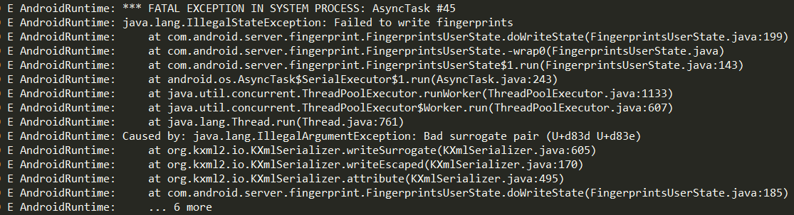

## 问题描述

在项目上，遇到了编辑指纹名称时输入特殊字符，随后会出现手机重启的奇葩问题。当输入一个emoji表情时，调用Google语音输入法，点击删除键，会出现 � 的非法符号，保存的时候底层检测到该符号为非法符号，会报Exception，导致system server进程直接挂掉，手机就自动重启了。

<!--more-->

crash log如下：



## Unicode和UTF编码的区别

两者区别如下：

- Unicode：统一的字符编号，仅仅提供字符与编号间的映射；
- UTF：unicode转换格式，定义unicode中编号的编码方式，常见的如UTF-8、UTF-16。UTF-8以8位为单位来标识文字，最大长度为4个字节；UTF-16以16位为单位来标识文字，目前机器的unicode一般指UTF-16，长度可能是2或4个字节。

在Java的内码（JVM）中，采用UTF-16的方式编码，一般符号（char）是占用2个字节，但随着unicode中字符的增加，2个字节无法表示所有的字符，UTF-16采用了2或4个字节来完成编码。在Java中，采取了一对char来表示那些需要4个字节的字符的方式来解决和兼容该问题。这里可以通过查看Java源码（果然最好的方法是看源码呀），查看CharSequence.java的源码可发现，length()方法的定义如下：

```java
/**
 * Returns the length of this character sequence.  The length is the number
 * of 16-bit <code>char</code>s in the sequence.</p>
 *
 * @return  the number of <code>char</code>s in this sequence
 */
int length();
```

由此可知，在Java中char占用2个字节（16 bit）。

## 问题具体分析

回到emoji的问题，经过把EditText的emoji表情String转换成byte数组，打印其length发现，emoji是占用4个字节的（也就是两个char），在Google语音输入法点击删除键时，删除了一个char（具体原因下面有分析），剩下一个char，因“d83d”无法解析，所以显示为我们刚才说的 � 乱码。log信息表格整理如下：


|   字符    |           unicode            |
| :-----: | :--------------------------: |
|   字符�   | 高8位：d8，低8位：3d（视emoji最高位字节而定） |
| emoji表情 |     从高到低依次为：d8 3d de 02      |
|   字符t   |         高8位：0，低8位：74         |

转换的方法代码如下：

```java
private String convertStr2Unicode(String str) {
    if (str == null)
        return "";

    StringBuffer sb = new StringBuffer(1000);
    String temp;
    for (int i = 0; i < str.length(); i++) {
        char c = str.charAt(i);
        sb.append("\\u");
        String high8Bit = Integer.toHexString(c >>> 8);
        Log.w(TAG, "convert high 8 bit: " + high8Bit);
        if (high8Bit.length() == 1)
            sb.append("0");
        sb.append(high8Bit);

        String low8Bit = Integer.toHexString(c & 0xFF);
        Log.w(TAG, "convert low 8 bit: " + low8Bit);
        if (low8Bit.length() == 1)
            sb.append("0");
        sb.append(low8Bit);
    }

    return new String(sb);
}
```

## 解决思路

### 1. 过滤emoji表情

增加指纹名称编辑框的文本过滤，若内容中含有emoji表情的字节码，则判定该文本含有非法字符，继而拦截指纹名称的修改动作。String匹配的方法如下：

```java
/**
 * 检测是否有emoji表情
 */
public static boolean containsEmoji(String source) {

    if (source == null) {
        return false;
    }
    
    for (int i = 0; i < source.length(); i++) {
        int codePoint = source.codePointAt(i);
        char c = source.charAt(i);
        Log.d(TAG, "containsEmoji codePoint=" + codePoint);
        Log.d(TAG, "containsEmoji char=" + c);
        Log.d(TAG, "containsEmoji char's unicode=" + convertChar2Unicode(c));
        if (isEmojiCharacter(codePoint)) {
            Log.e(TAG, "containsEmoji return=" + convertChar2Unicode(c));
            return true;
        }
    }

    return false;
}

private static boolean isEmojiCharacter(int first) {

    /* 1F30D - 1F567
    1F600 - 1F636
    24C2 - 1F251
    1F680 - 1F6C0
    2702 - 27B0
    1F601 - 1F64F*/

    return !
            ((first == 0x0)
            || (first == 0x9)
            || (first == 0xA)
            || (first == 0xD)
            || ((first >= 0x20) && (first <= 0xD7FF))
            || ((first >= 0xE000) && (first <= 0xFFFD))
            || (first >= 0x10000)
            || (first == 0xa9 || first == 0xae || first == 0x2122 ||
            first == 0x3030 || (first >= 0x25b6 && first <= 0x27bf) ||
            first == 0x2328 || (first >= 0x23e9 && first <= 0x23fa))
            || ((first >= 0x1F000 && first <= 0x1FFFF))
            || ((first >= 0x2702) && (first <= 0x27B0))
            || ((first >= 0x1F601) && (first <= 0x1F64F)));
}
```

这个解决方法可以处理特定的场景，但通用性并不强，需要在多个App的界面下进行过滤操作，这不是我们所想要的完美解决方法，所以接下来看一下第二种解决思路。

### 2. 重写EditText

这个解决思路是在整理这份文章的时候发现的，想着即使没有Google输入法源码，但输入法之类的实现应该跟Input输入系统有关，说不定可以了解到为什么会只删除一个char或者更多信息。奔着这个想法就重新看了下代码，然后惊喜的找到了更好的解决方法！（果然“温故而知新”啊！

先上一张输入法的框架图：


这张图可以提取一下几点信息（在这里感谢下互联网大牛的无私分享）：

> 两个过程：
>
> 按键消息，由客户端进程接收，如果客户端进程判断当前有输入法窗口，则需要跨进程转交给InputMethod进程
> 触屏消息（触摸在输入法窗口中），由输入法处理，结束后把结果跨进程提交给客户端进程
>
>
> 四个binder：
>
> IInputContext：负责InputMethod进程和应用进程的编辑框的通信，如上屏、查询光标前后字符等
> IInputMethodClient：IMMS使用该接口查找和IMS对应的客户端应用进程，并通知应用进程绑定/解绑输入法。
> IInputMethodSession：定义了客户端可以调用输入法的相关方法，如updateCursor, finishInput等
> IInputMethod：负责IMS和IMMS的通信，IMMS通知IMS进行startInput，bindInput等生命周期操作。
>
> 出处：https://www.jianshu.com/p/eb4ab57393f3

这里我们只关注第一点 "*按键消息，由客户端进程接收，如果客户端进程判断当前有输入法窗口，则需要跨进程转交给InputMethod进程*  "，那么在输入法界面按下删除键，会触发什么KeyEvent呢？我们可以对EditText设置OnKeyListener来监听Key事件：

```java
editText.setOnKeyListener(new OnKeyListener() {                 
    @Override
    public boolean onKey(View v, int keyCode, KeyEvent event) {
        //You can identify which key pressed 
      	//by checking keyCode value with KeyEvent.KEYCODE_
        if(keyCode == KeyEvent.KEYCODE_DEL) {  
            Log.w(TAG, "KEYCODE_DEL");
        }
        return false;       
    }
});
```

然后会发现，Google输入法按下删除键会触发`KEYCODE_DEL`，而Google语音输入法则不会触发。输入法删除字符时会触发到InputConnection的`deleteSurroundingText`方法（[参考](http://blog.csdn.net/jianguo_liao19840726/article/details/24714153)），而InputConnection的创建是在View的`onCreateInputConnection`方法中实现。

由上可知，删除的操作都围绕着 **InputConnection** 这个类来进行，那么我们就可以通过重写EditText类的`onCreateInputConnection`方法，创建自己的InputConnection来适配当前的问题场景，让EditText在执行删除操作时发送`KEYCODE_DEL`事件，响应OnKeyListener事件，问题就得到解决了。

以下是参考代码：

```java
public class MyCompatEditText extends EditText {

    private static final String TAG = MyCompatEditText.class.getSimpleName();

    public MyCompatEditText(Context context) {
        super(context);
    }

    public MyCompatEditText(Context context, AttributeSet attrs) {
        super(context, attrs);
    }

    public MyCompatEditText(Context context, AttributeSet attrs, int defStyleAttr) {
        super(context, attrs, defStyleAttr);
    }

    @Override
    public InputConnection onCreateInputConnection(EditorInfo outAttrs) {
        return new CompatInputConnection(super.onCreateInputConnection(outAttrs),
                true);
    }

    private class CompatInputConnection extends InputConnectionWrapper {
        CompatInputConnection(InputConnection target, boolean mutable) {
            super(target, mutable);
        }

        @Override
        public boolean sendKeyEvent(KeyEvent event) {
            Log.d(TAG, "sendKeyEvent keyCode=" + event.getKeyCode() 
                    + ", action=" + event.getAction());
            return super.sendKeyEvent(event);
        }

        @Override
        public boolean deleteSurroundingText(int beforeLength, int afterLength) {
            Log.d(TAG, "deleteSurroundingText beforeLength=" + beforeLength 
                    + ", afterLength=" + afterLength);
            if (beforeLength == 1 && afterLength == 0) {
                // in latest Android, deleteSurroundingText(1, 0) will be called for backspace
                // 删除emoji表情时，beforeLength == 1 afterLength == 0
                sendDownUpKeyEventForBackwardCompatibility(KeyEvent.KEYCODE_DEL);
                return true;
            }
            // 如果去掉上面新增的内容，默认就是走的这里，
            // 就会出现我们所说的emoji只删除一个char，且无法响应OnKeyListener事件
            return super.deleteSurroundingText(beforeLength, afterLength);
        }

        /**
         * 发送 KEYCODE_DEL 事件
         */
        private void sendDownUpKeyEventForBackwardCompatibility(final int code) {
            final long eventTime = SystemClock.uptimeMillis();
            sendKeyEvent(new KeyEvent(KeyEvent.ACTION_DOWN,
                    KeyEvent.KEYCODE_DEL));
            // 这里一定要发送ACTION_UP来通知Input系统事件结束，
            // 否则会在InputEventConsistencyVerifier的onKeyEvent方法中
            // 报出"ACTION_DOWN but key is already down and this event is not a key repeat."
            // 这是不正常的情况
            sendKeyEvent(new KeyEvent(KeyEvent.ACTION_UP,
                    KeyEvent.KEYCODE_DEL));
        }
    }
}
```

思路来自：

Stack Overflow：[Android EditText delete(backspace) key event](https://stackoverflow.com/questions/4886858/android-edittext-deletebackspace-key-event)

cnblogs：[图解Android - Android GUI 系统 (5) - Android的Event Input System](https://www.cnblogs.com/samchen2009/p/3368158.html)

注：EditText中Google原生键盘、华为P9等部分机型上出现的 del键无法响应OnKeyListener事件，也是同样的解法。